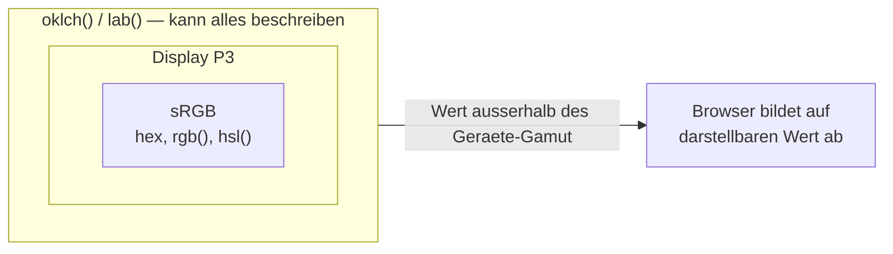

# Farben in CSS

## Kurz erklärt

CSS kennt mehrere Schreibweisen für denselben Zweck: eine Farbe angeben. Sie unterscheiden sich nicht in dem, was sie können, sondern darin, **wie gut sich Farben in ihnen verändern lassen**. Für einzelne feste Werte ist die Wahl gleichgültig — für Farbsysteme, Themes und Zustände (Hover, Disabled) entscheidet sie über den Aufwand.

Grobe Einteilung:

- **Gerätebezogen, nicht wahrnehmungsgleich:** Farbnamen, Hex, `rgb()`, `hsl()`
- **Wahrnehmungsbasiert:** `lab()`, `lch()`, `oklab()`, `oklch()`

## Hintergrund

Der praktische Unterschied lässt sich an `hsl()` zeigen. Dort sollte die Lightness gleiche Helligkeit bedeuten — tut sie aber nicht: `hsl(60, 100%, 50%)` (Gelb) wirkt deutlich heller als `hsl(240, 100%, 50%)` (Blau), obwohl beide `L: 50%` haben. Wer damit eine Farbpalette baut, muss jeden Farbton von Hand nachjustieren.

Genau das lösen die wahrnehmungsbasierten Modelle: Bei gleichem Lightness-Wert erscheinen Farben unabhängig vom Farbton gleich hell. Damit werden Abstufungen (`--brand-500`, `--brand-600` …) und Kontrastentscheidungen rechenbar statt geschmacksabhängig.

OKLCH ist die praxistauglichste dieser Notationen, weil sie die Nachteile von LCH bei stark gesättigten Farben korrigiert und Parameter hat, die man direkt versteht: Helligkeit, Buntheit, Farbton.

## Wichtige Aspekte

### Wertebereiche im Vergleich

| Notation | Parameter | Wertebereiche |
| --- | --- | --- |
| Hex | R, G, B (, A) | je `00`–`FF`; Kurzform `#FC0` |
| `rgb()` | R, G, B | `0`–`255` oder `0%`–`100%` |
| `hsl()` | H, S, L | `0`–`360`, `0%`–`100%`, `0%`–`100%` |
| `lab()` | L, a, b | Helligkeit; Achsen ca. `-128`–`+127` |
| `lch()` | L, C, H | `0%`–`100%`, `0`–ca. `130`, `0`–`360` |
| `oklch()` | L, C, H | `0`–`1`, `0`–ca. `0.4`, `0`–`360` |

Der Hue-Winkel ist bei HSL, LCH und OKLCH gleich belegt: 0 Rot, 60 Gelb, 120 Grün, 180 Cyan, 240 Blau, 300 Magenta. Das Gradzeichen wird weggelassen.

### Alphakanal

Jede Notation kennt Transparenz: als viertes Hex-Paar (`#FF000080`), über `rgba()`/`hsla()` oder — moderner und einheitlich — über die Slash-Syntax `oklch(0.7 0.2 240 / 50%)`. `rgba()` und `hsla()` sind heute nur noch Aliase; `rgb()` und `hsl()` nehmen den Alphawert selbst entgegen.

### Gamut

Hohe Chroma-Werte liegen außerhalb von sRGB und sind nur in erweiterten Farbräumen wie Display P3 darstellbar. Browser bilden sie auf einen darstellbaren Wert ab. Für verlässliche Ergebnisse auf allen Geräten lohnt es sich, im sRGB-Bereich zu bleiben oder gezielt mit `@media (color-gamut: p3)` zu arbeiten.



Der Unterschied ist nicht die Syntax, sondern der Umfang: `hsl()` **kann** keine Farbe außerhalb von sRGB benennen, `oklch()` schon. Ob sie ankommt, entscheidet das Ausgabegerät.

### Mischen mit `color-mix()`

`color-mix()` mischt zwei Farben **zur Laufzeit im Browser**:

```css
:root { --brand: oklch(0.55 0.14 210); }

.button:hover {
  background: color-mix(in oklab, var(--brand) 80%, black);
}
```

<a href="beispiele/farben-01-color-mix.htm" target="_blank" rel="noopener">↗ Beispiel in neuem Tab öffnen</a>

Zwei Dinge sind daran wichtig:

1. Der Farbraum ist Pflicht (`in oklab`, `in srgb` …). Ohne `in …` ist der Ausdruck ungültig.
2. Es funktioniert mit CSS-Variablen. Damit ersetzt es Präprozessor-Funktionen wie `mix()` in Sass nicht nur, sondern kann etwas, das diese prinzipiell nicht können: Es reagiert auf zur Laufzeit gesetzte Werte, also auf Themes, Dark Mode und Nutzereinstellungen.

Der gewählte Mischfarbraum bestimmt das Ergebnis: `in oklab` liefert gleichmäßigere Verläufe als `in srgb`, das bei komplementären Farben durch matschiges Grau geht.

### Ableiten mit relativen Farbangaben

`color-mix()` mischt zwei fertige Farben. Die **relative Farbsyntax** aus CSS Color Level 5 geht einen Schritt weiter: Sie zerlegt eine Bezugsfarbe in ihre Kanäle und setzt sie neu zusammen. Eingeleitet wird das mit dem Schlüsselwort `from`:

```css
:root { --bg-color: blue; }
.overlay { background: rgb(from var(--bg-color) r g b / 20%); }
```

<a href="beispiele/farben-02-relative-farbe.htm" target="_blank" rel="noopener">↗ Beispiel in neuem Tab öffnen</a>

Die Kanäle werden durch die Buchstaben des jeweiligen Farbmodells benannt (`r g b`, `l c h`, `l a b`), die Deckkraft über `alpha`. Ein Kanal, der unverändert bleiben soll, wird einfach als Buchstabe notiert; ein Kanal, der sich ändern soll, wird gerechnet — siehe [[grundlagen/berechnungen|CSS calc()]]:

```css
:root {
  --base: oklch(0.55 0.14 210);

  /* Helligkeitsstufen */
  --base-light: oklch(from var(--base) calc(l + 0.25) c h);
  --base-dark:  oklch(from var(--base) calc(l - 0.25) c h);

  /* Harmonien über den Farbtonwinkel */
  --accent-warm:       oklch(from var(--base) l c calc(h + 20));
  --accent-complement: oklch(from var(--base) l c calc(h + 180));
  /* triadisch: calc(h + 120) und calc(h - 120) */
}
```

<a href="beispiele/farben-03-farbfamilie.htm" target="_blank" rel="noopener">↗ Beispiel in neuem Tab öffnen</a>

Damit verschwindet die häufigste Sorte **Magic Number** aus dem Stylesheet: Statt `#3a7bd5` und daneben `#2a6bb8` ohne erkennbaren Zusammenhang steht die Herleitung im Code.

Zwei Dinge sind zu beachten:

1. **Wertebereiche gehören zum Farbmodell.** In OKLCH liegt L zwischen 0 und 1, also `calc(l + 0.25)`. In LCH ist L eine Prozentangabe von 0 bis 100 — dort wäre `calc(l + 25)` richtig. Wer Beispiele zwischen den Modellen kopiert, klemmt die Farbe auf Weiß oder Schwarz.
2. **Die Bezugsfarbe darf in einem beliebigen Modell stehen**, CSS rechnet um. Bei der Umrechnung einer Farbe außerhalb von sRGB in `rgb()` entsteht dabei eine Ersatzfarbe.

Für Schriftfarben auf berechneten Hintergründen gibt es zusätzlich `contrast-color(var(--tone))`: Der Browser wählt selbst die kontrastreichste Farbe. **Das ist noch nichts für den Produktiveinsatz:** `contrast-color()` ist erst seit 2026-04-10 Baseline *newly available* (Chrome/Edge 147, Firefox 146, Safari 26) und damit rund fünf Monate alt. Bis auf Weiteres bleibt die berechnete Variante mit anschließendem Kontrasttest der sichere Weg.

### Farbinterpolation

Sobald CSS zwischen zwei Farben *übergeht*, stellt sich die Frage nach dem Farbraum. Das betrifft `transition` und `animation`, Verläufe, Filter und `color-mix()` gleichermaßen. Die Angabe wird mit `in` eingeleitet:

```
in <system> [ <richtung> hue ]
```

| System | Verhalten |
| --- | --- |
| `srgb` | technisch einfach, aber nicht auf gleichmäßige Wahrnehmung ausgelegt — Verläufe wirken oft zu dunkel oder grau |
| `srgb-linear`, `xyz`, `xyz-d50`, `xyz-d65` | lineare Lichtintensität, entspricht der Mischung farbigen Lichts |
| `lab`, `oklab` | wahrnehmungsnäher, gleichmäßiger Übergang |
| `hsl`, `hwb` | polar; der Übergang läuft über die Farbtöne und wird bei Rot → Blau eher ein Spektrum als ein Übergang |
| `lch`, `oklch` | polar und wahrnehmungsgleichförmig, vermeidet das „Ausgrauen" |

Bei polaren Systemen kommt die **Drehrichtung** dazu: `shorter` (Standard, kleinerer Winkel), `longer` (größerer Winkel), `increasing` und `decreasing` (auf- bzw. absteigende Winkelwerte, unabhängig von der Länge). `color-mix(in oklch longer hue, …)` läuft also bewusst den langen Weg um den Farbkreis.

### HSL ist nicht HSB/HSV

Eine Falle beim Übergang aus der Bildbearbeitung ins CSS: Das W3C hat sich für **HSL** entschieden, Photoshop und viele Color Picker (auch der von macOS) arbeiten mit **HSB**, das auch HSV genannt wird. Beide teilen sich den Farbton, aber nicht Sättigung und Helligkeit.

HSB (300, 18 %, 78 %) entspricht HSL (300, 24 %, 71 %) — wer die Zahlen unverändert überträgt, bekommt den richtigen Farbton bei falscher Sättigung und falscher Helligkeit, und sucht den Fehler lange an der falschen Stelle.

**Arbeitsregel: Aus einem Bildbearbeitungsprogramm nie HSB-Zahlen übernehmen.** Hex oder RGB nehmen — oder die Farbe gleich in OKLCH bestimmen.

## Beispiele

Eine Palette mit konstanter Helligkeitsstufung — in OKLCH trivial, in HSL Handarbeit:

```css
:root {
  --blue-500:  oklch(0.60 0.20 250);
  --green-500: oklch(0.60 0.20 145);
  --red-500:   oklch(0.60 0.20  25);
  /* gleiche wahrgenommene Helligkeit, gleiche Buntheit */
}
```

<a href="beispiele/farben-04-gleiche-helligkeit.htm" target="_blank" rel="noopener">↗ Beispiel in neuem Tab öffnen</a>

Abstufungen desselben Farbtons über die Lightness:

```css
:root {
  --brand-300: oklch(0.80 0.12 210);
  --brand-500: oklch(0.60 0.14 210);
  --brand-700: oklch(0.40 0.12 210);
}
```

<a href="beispiele/farben-05-farbskala.htm" target="_blank" rel="noopener">↗ Beispiel in neuem Tab öffnen</a>

## Eigene Notizen / Einordnung

Arbeitsregel für neue Projekte: **OKLCH als Definitionsformat, `color-mix(in oklab, …)` für Ableitungen, Hex nur noch dort, wo ein Wert von außen kommt** (Corporate Design, Design-Token-Export, Drittanbieter-Snippet).

Ergänzung nach den SELFHTML-Quellen (2026-09-03): Für Paletten ist die relative Syntax `oklch(from …)` der `color-mix()`-Variante vorzuziehen, weil sie sagt, **welcher Kanal** sich ändert. `color-mix()` bleibt für Zustände (Hover, Disabled) und als Fallback in älteren Browsern richtig. Ideal ist eine einzige gepflegte Grundfarbe `--base`, aus der Stufen, Akzente und Kontraste abgeleitet werden — dann ändert ein Theme genau einen Wert.

`hsl()` bleibt für schnelle Handarbeit brauchbar, weil man den Farbton im Kopf hat. Sobald aber mehrere Farben systematisch zusammenpassen sollen, ist es die falsche Grundlage.

### Browsersupport

| Feature | Baseline | Seit | Ab Version |
| --- | --- | --- | --- |
| OKLab/OKLCH | widely available | 2025-11-09 (newly: 2023-05-09) | Chrome 111, Firefox 113, Safari 15.4 |
| `color-mix()` | widely available | 2025-11-09 (newly: 2023-05-09) | Chrome 111, Firefox 113, Safari 16.2 |
| Relative Farbangaben (`from`) | newly available | 2024-09-16 | Chrome 125, Firefox 128, Safari 18 |
| `contrast-color()` | newly available | 2026-04-10 | Chrome 147, Firefox 146, Safari 26 |
| `color-mix()` mit drei oder mehr Farben | **nicht Baseline** | – | bisher nur Firefox 150 |

Für den Alltag heißt das: OKLCH und zweifarbiges `color-mix()` sind unbedenklich. Relative Farbangaben und `contrast-color()` brauchen einen Fallback, und die variadische Form von `color-mix()` ist derzeit unbenutzbar — drei Farben mischt man geschachtelt.

Quelle: `web-features` 3.36.0 (Baseline-Daten der W3C WebDX Community Group), lokal abgefragt am 2026-09-03.

## Siehe auch

- [[selektoren/nesting|CSS-Nesting]]
- [[grundlagen/variablen|CSS Custom Properties]] — Träger der Farbtokens
- [[grundlagen/berechnungen|CSS calc()]] — die Rechenvorschrift in den Farbkanälen

## Quellen

- [[quellen/artikel/farben-in-der-praxis|CSS Farben in der Praxis – von Hexadezimal bis oklch()]] — Notationen und Wertebereiche
- [[quellen/artikel/color-mix-funktion|CSS color-mix() Funktion]] — Mischen in CSS; dort auch der Hinweis, dass der Standardfarbraum entgegen der Quelle Oklab ist und nicht `lch`
- [[quellen/artikel/relative-farbangaben|Relative Farbangaben (SELFHTML)]] — `from`-Syntax, abgeleitete Paletten, Farbinterpolation und Drehrichtung
- [[quellen/artikel/farbrechner|Farbrechner – OKLCH, HSL, HSV, RGB und Hex umrechnen]] — HSL vs. HSB/HSV, OKLCH-Farbrad, Light-/Dark-Paletten

Die Kritik an HSL, die Empfehlung zum Mischfarbraum und die Arbeitsregel oben stammen nicht aus den Quellen, sondern sind eigene Einordnung. Ebenfalls eigene Ergänzung: der Hinweis auf die unterschiedlichen L-Wertebereiche von OKLCH und LCH — die SELFHTML-Quelle enthält an einer Stelle ein Beispiel, das diese Bereiche verwechselt.
