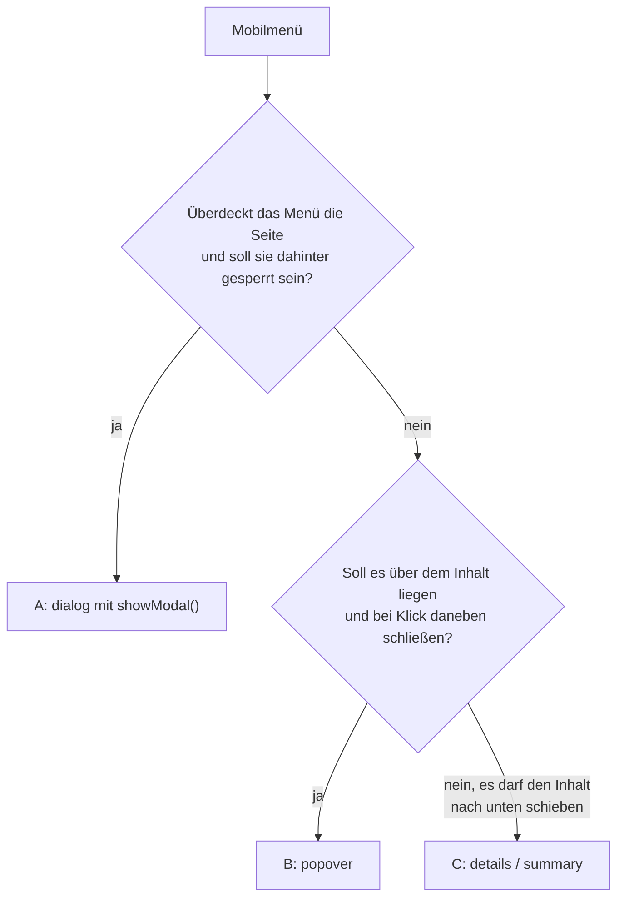

# Mobile-Menü ohne Checkbox-Hack bauen

## Ziel

Ein aufklappbares Menü für kleine Bildschirme, das Fokus, `Esc`, Screenreader-Zustand und Schließen zuverlässig beherrscht – mit so wenig JavaScript wie möglich.

## Voraussetzungen

- Eine semantisch aufgebaute Linkliste, siehe [[navigation/hauptnavigation|Hauptnavigation semantisch aufbauen]].
- Für Variante A: Invoker Commands (seit 2025-12-12 Baseline *newly available*) oder das kleine Polyfill unten.
- Das Zusammenspiel von `popover` und `dialog`: [[navigation/top-layer|Top Layer mit popover und dialog]].

## Getestet mit / Stand

Stand 2026-09-13. **Variante A in Chrome 152 (macOS) getestet:** Invoker Commands öffnen modal, `autofocus` landet auf „Schließen“, `Esc` schließt und gibt den Fokus an den Menü-Button zurück, Ein- und Ausblenden laufen, das Polyfill schaltet nicht doppelt, wenn der Browser Invoker Commands selbst kann. **Nicht getestet:** Varianten B und C, Firefox, Safari, Mobilgeräte, Screenreader. Die Idee, ein Off-Canvas-Menü als modalen `dialog` mit Invoker Commands zu bauen, stammt aus einem Praxisbericht von David Bushell; die Codebeispiele hier sind eigene, weil seine Website unter „All Rights Reserved“ steht.

## Vorgehen

### Variante wählen



Die Entscheidungsregeln sind eigene Einordnung aus den Eigenschaften von `dialog` und `popover`. Variante C ist in keiner der ausgewerteten Quellen als Navigationsmuster beschrieben.

### Variante A: Vollbild-Menü als modaler Dialog

1. **Button und Dialog:**

   ```html
   <button type="button" class="menu-button" commandfor="site-menu" command="show-modal">
     Menü
   </button>

   <dialog id="site-menu" class="menu-dialog" aria-label="Menü">
     <button type="button" class="menu-close" commandfor="site-menu" command="close" autofocus>
       Schließen
     </button>
     <nav aria-label="Hauptmenü">
       <ul>
         <li><a href="/" aria-current="page">Start</a></li>
         <li><a href="/leistungen/">Leistungen</a></li>
         <li><a href="/kontakt/">Kontakt</a></li>
       </ul>
     </nav>
   </dialog>
   ```

   `command="show-modal"` und `command="close"` sind die Invoker-Befehle für Dialoge.[^mdn-dialog] `autofocus` gehört laut MDN auf das Element, mit dem man zuerst interagiert, im Zweifel auf den Schließen-Button.[^mdn-dialog]

2. **Polyfill für Browser ohne Invoker Commands:**

   ```js
   if (!("command" in HTMLButtonElement.prototype)) {
     document.addEventListener("click", (event) => {
       const button = event.target.closest("button[commandfor]");
       if (!button) return;
       const dialog = document.getElementById(button.getAttribute("commandfor"));
       if (!(dialog instanceof HTMLDialogElement)) return;
       const command = button.getAttribute("command");
       if (command === "show-modal" && !dialog.open) dialog.showModal();
       if (command === "close" && dialog.open) dialog.close();
     });
   }
   ```

   Die Feature-Erkennung prüft die JavaScript-Eigenschaft `command` am Button, die MDN als Gegenstück zum Attribut beschreibt.[^mdn-invoker] Das Skript deckt nur Dialoge und die zwei Befehle ab; für die volle API gibt es das Polyfill von Keith Cirkel.

3. **Klick auf den Hintergrund schließt** nur mit `closedby="any"` am `dialog`.[^mdn-dialog] Das fehlt laut `web-features` 3.38.0 in Safari – dort bleibt `Esc` bzw. der Schließen-Button. Beim Vollbild-Menü aus Schritt 4 gibt es allerdings keinen sichtbaren Hintergrund zum Anklicken; `closedby` wirkt nur, wenn der Dialog kleiner als der Viewport ist.

4. **Als Vollbild darstellen:**

   ```css
   .menu-dialog {
     margin: 0;
     width: 100%;
     max-width: none;
     height: 100dvh;
     max-height: none;
     border: 0;
     box-sizing: border-box;
   }
   ```

   `dvh` folgt den ein- und ausfahrenden Browserleisten auf Mobilgeräten.[^viewport] Das Zurücksetzen von `max-width` und `max-height` beruht auf der Annahme, dass Browser modale Dialoge standardmäßig begrenzen – nicht an einer Quelle belegt. `box-sizing: border-box` ist nötig, weil `dialog` in Chrome standardmäßig `padding: 16px` hat; ohne diese Zeile war das Menü im Test 17 × 32 Pixel größer als der Viewport.

5. **Button nur auf kleinen Bildschirmen zeigen**, sonst die normale Navigation:

   ```css
   @media (width >= 48rem) {
     .menu-button { display: none; }
   }
   @media (width < 48rem) {
     .site-header > nav { display: none; }
   }
   ```

   Die Links stehen damit zweimal im HTML: sichtbar im Header und im Dialog. Das ist ein bewusster Kompromiss, damit der Dialog nicht per CSS zwangsweise angezeigt werden muss. Alternativ nutzt man das Menü bei allen Breiten – so macht es Bushell.

### Variante B: Menü als Popover

```html
<button type="button" class="menu-button" popovertarget="menu-panel">Menü</button>
<nav id="menu-panel" popover aria-label="Hauptmenü">
  <ul>…</ul>
</nav>
```

- Klick daneben und `Esc` schließen, `aria-expanded` am Button setzt der Browser, der Fokus springt beim Tabben in das Menü.[^mdn-popover][^hidde]
- Die Seite dahinter bleibt bedienbar – kein Fokusfang, kein inerter Hintergrund. Für ein Panel, das nur einen Teil der Seite überdeckt, passt das.
- Position wie in [[navigation/dropdown-navigation|Dropdown-Navigation mit Disclosure-Buttons bauen]] überschreiben, sonst erscheint das Menü mittig.

### Variante C: `details` / `summary`

```html
<details class="menu-disclosure">
  <summary>Menü</summary>
  <nav aria-label="Hauptmenü">
    <ul>…</ul>
  </nav>
</details>
```

Ohne JavaScript und ohne Top Layer: Das Menü schiebt den Inhalt nach unten. `details` ist ein natives Disclosure-Widget.[^mdn-details] Wie Screenreader `summary` als Menüschalter ansagen, ist hier nicht geprüft.

### Ein- und Ausblenden animieren

Das Menü fährt von rechts herein und blendet dabei auf – nach dem Muster aus der MDN-Referenz für `dialog`:[^mdn-dialog]

```css
@media (prefers-reduced-motion: no-preference) {
  .menu-dialog[open] {
    opacity: 1;
    translate: 0 0;
  }

  .menu-dialog {
    opacity: 0;
    translate: 2rem 0;
    transition:
      opacity 250ms ease-out,
      translate 250ms ease-out,
      overlay 250ms allow-discrete,
      display 250ms allow-discrete;
  }

  @starting-style {
    .menu-dialog[open] {
      opacity: 0;
      translate: 2rem 0;
    }
  }
}
```

Hintergründe und Fallen: [[animation/ein-und-ausblenden|Ein- und Ausblenden mit CSS animieren]].

## Warum funktioniert das?

- `showModal()` legt den Dialog in den Top Layer, macht den Rest der Seite inert und fokussiert das erste fokussierbare Element; `Esc` schließt.[^mdn-dialog] Genau das musste man früher für Off-Canvas-Menüs selbst bauen.
- Invoker Commands verbinden Button und Dialog ohne eigenes Skript.[^mdn-invoker]
- Beim Popover übernimmt der Browser `aria-expanded`, Tab-Reihenfolge und Light dismiss.[^hidde]

### Warum nicht der Checkbox-Hack?

Beim Checkbox-Hack steuert ein verstecktes `<input type="checkbox">` mit `<label>` die Sichtbarkeit per `:checked`. Dagegen spricht – **eigene Einordnung, in keiner der ausgewerteten Quellen belegt**:

- Assistive Technologien bekommen eine Checkbox angesagt, keinen Schalter für ein Menü; ein `aria-expanded` gibt es nicht.
- `Esc`, Fokusrückgabe, Fokusfang und Klick daneben fehlen und müssten ohnehin per Skript nachgebaut werden.
- Seit `popover` und `dialog` deklarativ steuerbar sind, entfällt das Hauptargument „ohne JavaScript“.

## Fallstricke

- **WebKit-Fokusring:** Nach `showModal()` bzw. Invoker Commands zeigt WebKit laut David Bushell den `:focus-visible`-Stil am ersten Button auch bei Mausbedienung.[^bushell] Einen Workaround beschreibt er selbst als ungetestet. Nicht in Safari nachgeprüft.
- **Kein `tabindex` auf `dialog`.**[^mdn-dialog]
- **Scrollen der Seite hinter dem Dialog:** Ob ein modaler Dialog das verhindert, ist in den Quellen nicht beschrieben. Eine verbreitete Lösung ist `body:has(dialog[open]) { overflow: hidden; }` (siehe [[selektoren/has|CSS-Pseudoklasse has()]]). Im Chrome-Test scrollte die Seite hinter dem offenen Dialog mit und ohne diese Regel weiter – das verwendete Werkzeug scrollt aber vermutlich per Skript, was `overflow: hidden` ohnehin nicht verhindert. Mit echtem Mausrad bzw. Touch ist das noch zu prüfen.
- **`closedby` fehlt in Safari:** Das Menü bleibt bedienbar, nur ein Klick daneben schließt dort nicht.
- **Ausblend-Animation nicht überall:** `display`-Transitions fehlen in Firefox, das Menü verschwindet dort beim Schließen sofort. `overlay` gibt es nur in Chromium; ob die Animation in Safari ohne `overlay` sichtbar abgeschnitten wird, ist nicht geprüft – MDN nennt den Effekt bei einfachen Animationen „möglicherweise nicht bemerkbar“.[^mdn-popover]
- **Button-Beschriftung:** Nur ein Icon ohne Text ist schwer verständlich; ein sichtbares Wort wie „Menü“ hilft. Zusatzwörter wie „öffnen“ im Namen können laut dem Feedback, das Bushell wiedergibt, Sprachsteuerung stören.[^bushell]
- **Doppelte Links (Variante A):** Die Menüinhalte müssen an beiden Stellen gleich gepflegt werden; bei Templates oder Komponenten unkritisch, bei Handarbeit fehleranfällig.

### Browsersupport

| Feature | Stand |
| --- | --- |
| `dialog`, `inert` | Baseline *widely available* |
| `details` | Baseline *widely available* |
| Viewport-Einheiten `dvh`, `svh`, `lvh` | Baseline *widely available* (seit 2022-12-05 *newly*) |
| `popover` | Baseline *newly available* seit 2025-01-27 |
| `@starting-style`, `transition-behavior` | Baseline *newly available* seit 2024-08-06 |
| `display` animieren/transitionieren | *limited*: Chrome 117, Safari 18, Firefox fehlt |
| Invoker Commands | Baseline *newly available* seit 2025-12-12 |
| `closedby` | *limited*: Chrome 134, Firefox 141, Safari fehlt |
| `overlay` | *limited*: nur Chromium ab 117 |

Quelle: `web-features` 3.38.0 (Baseline-Daten der W3C WebDX Community Group), lokal abgefragt am 2026-09-12.

## Siehe auch

- [[navigation/top-layer|Top Layer mit popover und dialog]]
- [[navigation/hauptnavigation|Hauptnavigation semantisch aufbauen]]
- [[navigation/dropdown-navigation|Dropdown-Navigation mit Disclosure-Buttons bauen]]
- [[animation/ein-und-ausblenden|Ein- und Ausblenden mit CSS animieren]]
- [[animation/view-transitions|View Transitions]]

## Quellen

- David Bushell, Praxisbericht (siehe Fußnote) — Idee für Variante A, WebKit-Fokusfehler, Hinweis zur Beschriftung; kein Code übernommen
- [[quellen/artikel/dialog-element-mdn|dialog-Element (MDN)]] — Verhalten modaler Dialoge, `closedby`, `autofocus`
- [[quellen/artikel/invoker-commands-mdn|Invoker Commands API (MDN)]] — `command`, `commandfor`, Feature-Erkennung
- [[quellen/artikel/popover-api-mdn|Using the Popover API (MDN)]] und [[quellen/artikel/popover-accessibility-devries|On popover accessibility – what the browser does and doesn't do]] — Variante B
- [[quellen/artikel/details-element-mdn|details-Element (MDN)]] — Variante C
- [[quellen/artikel/viewport-einheiten-webdev|The large, small, and dynamic viewport units (web.dev)]] — `dvh`

Eigene Einordnung bzw. eigener Code: Entscheidungsdiagramm, alle HTML-, CSS- und JavaScript-Beispiele (Animation nach dem MDN-Muster), Variante C als Menü, Breakpoint-Umschaltung, die Kritik am Checkbox-Hack und der Hinweis zu `body:has(dialog[open])`.

[^bushell]: David Bushell, „Declarative Dialog Menu with Invoker Commands“, dbushell.com, 12.02.2026, <https://dbushell.com/2026/02/12/declarative-dialog-menu-invoker-commands/>. Abgerufen 2026-09-12; die Website steht unter „All Rights Reserved“, daher hier nur sinngemäß und ohne Code.
[^mdn-invoker]: [[quellen/artikel/invoker-commands-mdn|Invoker Commands API (MDN)]].
[^mdn-dialog]: [[quellen/artikel/dialog-element-mdn|dialog-Element (MDN)]], Abschnitte „Attributes“, „Additional notes“ und „Accessibility“.
[^mdn-popover]: [[quellen/artikel/popover-api-mdn|Using the Popover API (MDN)]].
[^hidde]: [[quellen/artikel/popover-accessibility-devries|On popover accessibility – what the browser does and doesn't do]].
[^mdn-details]: [[quellen/artikel/details-element-mdn|details-Element (MDN)]].
[^viewport]: [[quellen/artikel/viewport-einheiten-webdev|The large, small, and dynamic viewport units (web.dev)]].
