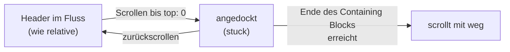

# Sticky-Header einrichten

## Ziel

Ein Seitenkopf, der beim Scrollen oben stehen bleibt, ohne Inhalt zu verdecken – auch nicht bei Sprunglinks auf Überschriften. Optional mit Schatten, sobald er angedockt ist.

## Voraussetzungen

- Keine. Alle Kernfunktionen sind laut `web-features` 3.38.0 Baseline *widely available*.
- Für den Schatten im angedockten Zustand: Scroll-State-Queries, derzeit nur Chromium.

## Getestet mit / Stand

Stand 2026-09-12. **In Chrome 152 (macOS), 2026-09-13 getestet:** Header klebt, Schatten erscheint erst im angedockten Zustand, `scroll-margin-top` und die Alternative `scroll-padding-top` setzen das Sprungziel unter den Header, und beide Fallen (kurzer Wrapper, `overflow` am Vorfahren) lassen sich nachstellen. **Nicht getestet:** Firefox, Safari, Mobilgeräte. Die Mechanik von `sticky` stammt aus MDN, die Sprunglink-Lösung aus CSS-Tricks, der Schatten aus einem Chrome-Artikel.

## Vorgehen

1. **Header sticky machen – mit Schwelle.** Ohne `top` (oder eine andere Inset-Eigenschaft) verhält sich `sticky` wie `relative`.[^mdn]

   ```css
   :root {
     --header-height: 4rem;
   }

   .site-header {
     position: sticky;
     top: 0;
     z-index: 10;
     min-block-size: var(--header-height);
     background: Canvas;
   }
   ```

   <a href="beispiele/sticky-header-01-sticky.htm" target="_blank" rel="noopener">↗ Beispiel in neuem Tab öffnen</a>

   Der Hintergrund ist nötig, sonst scheint der Inhalt beim Scrollen durch.

2. **Header als direktes Kind von `body` platzieren.** Ein sticky Element klebt nur, bis es an den gegenüberliegenden Rand seines Containing Blocks stößt.[^mdn] Steckt der Header in einem Wrapper, der nur so hoch ist wie er selbst, gibt es keinen Weg, auf dem er kleben könnte.

3. **Kein `overflow: hidden | auto | scroll` an Vorfahren.** Das erzeugt einen „Scroll-Mechanismus“, an dem der Header dann klebt – auch wenn dieser Vorfahr gar nicht scrollt.[^mdn]

4. **Sprungziele unter dem Header sichtbar halten.**[^csstricks]

   ```css
   :target,
   h2[id],
   h3[id] {
     scroll-margin-top: calc(var(--header-height) + 1rem);
   }
   ```

   <a href="beispiele/sticky-header-02-scroll-margin-top.htm" target="_blank" rel="noopener">↗ Beispiel in neuem Tab öffnen</a>

   Alternative am Scroll-Container statt an jedem Ziel:

   ```css
   html {
     scroll-padding-top: calc(var(--header-height) + 1rem);
   }
   ```

   <a href="beispiele/sticky-header-03-scroll-padding-top.htm" target="_blank" rel="noopener">↗ Beispiel in neuem Tab öffnen</a>

5. **Optional: Schatten, sobald der Header angedockt ist.** Das abgefragte Element ist der Header selbst, reagieren kann nur ein Kind.[^scroll-state]

   ```html
   <header class="site-header">
     <div class="site-header__inner">…</div>
   </header>
   ```

   ```css
   @supports (container-type: scroll-state) {
     .site-header {
       container-type: scroll-state;
     }

     .site-header__inner {
       transition: box-shadow 0.3s ease;

       @container scroll-state(stuck: top) {
         box-shadow: 0 2px 8px rgb(0 0 0 / 15%);
       }
     }
   }
   ```

   <a href="beispiele/sticky-header-04-schatten-angedockt.htm" target="_blank" rel="noopener">↗ Beispiel in neuem Tab öffnen</a>

## Warum funktioniert das?



- `sticky` ist **relativ positioniert, bis die Schwelle erreicht ist**, dann „stuck“ bis zum Ende des Containing Blocks.[^mdn] Weil der Header bis dahin im normalen Fluss steht, braucht der Inhalt darunter – anders als bei `position: fixed` – kein `padding-top` als Platzhalter. Das ist eine Ableitung aus der Definition.
- Ist `body` der Containing Block, reicht der Weg über die ganze Seite. Deshalb Schritt 2.
- `scroll-margin-top` vergrößert den Abstand, den der Browser beim Scrollen zu einem Ziel einhält. Genau um die Headerhöhe versetzt, landet die Überschrift sichtbar darunter.[^csstricks]
- `container-type: scroll-state` stellt den browserverwalteten Zustand „angedockt“ als Container Query zur Verfügung.[^scroll-state]

## Fallstricke

- **`sticky` „funktioniert nicht“:** fast immer fehlendes `top`, ein `overflow` an einem Vorfahren oder ein zu kurzer Containing Block.[^mdn]
- **`z-index`:** `sticky` erzeugt immer einen eigenen Stapelkontext.[^mdn] Positionierte Inhalte der Seite können trotzdem darüber liegen, wenn ihr Stapelkontext höher ist. Der Wert im Beispiel ist willkürlich.
- **Headerhöhe ändert sich** (Umbruch auf kleinen Bildschirmen): Dann stimmt `--header-height` nicht mehr, Sprungziele landen teilweise darunter. Die Variable bei Breakpoints anpassen oder großzügig rechnen.
- **Hoher Header auf Mobilgeräten** frisst dauerhaft Platz. Das ist eine Gestaltungsfrage, keine technische.
- **Ruckeln beim Scrollen:** Sticky Inhalte müssen neu gezeichnet werden. MDN schlägt `will-change: transform` vor.[^mdn] web.dev rät dagegen, `will-change` nur gezielt einzusetzen[^webdev] – erst messen, dann setzen.
- **Scroll-State-Queries** gibt es nur in Chromium (ab 133). Ohne `@supports` ist das kein Fehler – der Schatten fehlt dann einfach –, die Abfrage macht die Absicht aber lesbar.
- **Header beim Herunterscrollen ausblenden, beim Hochscrollen zeigen:** braucht bisher JavaScript. Nicht Teil dieser Anleitung und nicht recherchiert.
- **Bewegung:** Wer den Header beim Andocken animiert (Größe, Position), legt das in `@media (prefers-reduced-motion: no-preference)`.[^scroll-state] Siehe [[animation/barrierearme-animationen|Barrierearme Animationen]].

### Browsersupport

| Feature | Stand |
| --- | --- |
| `position: sticky` | Baseline *widely available* (seit 2019-09-19 *newly*) |
| `scroll-margin-top`, `scroll-padding-top` | Baseline *widely available* (seit 2021-04-26 *newly*) |
| Container Queries | Baseline *widely available* (seit 2023-02-14 *newly*) |
| Scroll-State-Queries (`stuck`, `snapped`, `scrollable`) | *limited*: Chrome/Edge 133, Firefox und Safari fehlen |

Quelle: `web-features` 3.38.0 (Baseline-Daten der W3C WebDX Community Group), lokal abgefragt am 2026-09-12.

## Siehe auch

- [[navigation/hauptnavigation|Hauptnavigation semantisch aufbauen]]
- [[animation/scroll-getriebene-animationen|Scroll-getriebene Animationen]]
- [[navigation/mobilmenue|Mobile-Menü ohne Checkbox-Hack bauen]]

## Quellen

- [[quellen/artikel/position-mdn|position CSS-Eigenschaft (MDN)]] — Definition von `sticky`, Overflow-Falle, Stapelkontext, Performance
- [[quellen/artikel/scroll-margin-top-csstricks|Fixed Headers and Jump Links – scroll-margin-top (CSS-Tricks)]] — Sprungziele unter festem Header
- [[quellen/artikel/scroll-state-chrome|CSS scroll-state() (Chrome for Developers)]] — Zustand „angedockt“ abfragen
- [[quellen/artikel/performante-animationen-webdev|How to create high-performance CSS animations (web.dev)]] — `will-change` gezielt einsetzen

Nicht aus den Quellen: `scroll-padding-top` als Alternative (Baseline-Daten und Chrome-Test), die Custom Property für die Headerhöhe, die Wrapper-Erklärung in Schritt 2 als Folgerung aus der MDN-Definition, das Diagramm und die Fallstricke zu wechselnder Headerhöhe.

[^mdn]: [[quellen/artikel/position-mdn|position CSS-Eigenschaft (MDN)]], Abschnitte zu `sticky` und „Accessibility“.
[^csstricks]: [[quellen/artikel/scroll-margin-top-csstricks|Fixed Headers and Jump Links – scroll-margin-top (CSS-Tricks)]].
[^scroll-state]: [[quellen/artikel/scroll-state-chrome|CSS scroll-state() (Chrome for Developers)]], Abschnitte „First scroll-state query“, „Progressive Enhancement“ und „Add a shadow when stuck“.
[^webdev]: [[quellen/artikel/performante-animationen-webdev|How to create high-performance CSS animations (web.dev)]], Abschnitt „Force layer creation“.
