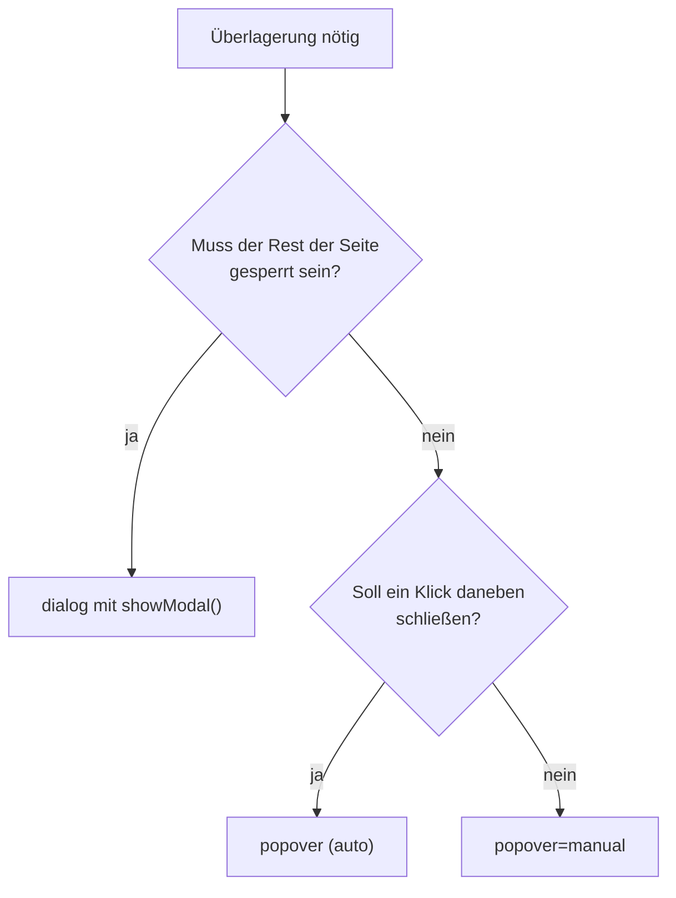

# Top Layer mit popover und dialog

## Kurz erklärt

`popover` und `dialog` zeigen Inhalte **über allem anderen Seiteninhalt** an, im sogenannten Top Layer.[^mdn-popover] Praktische Folge: `z-index`-Kämpfe und abschneidendes `overflow` eines Vorfahren spielen dort keine Rolle mehr – das ist eigene Ableitung, nicht wörtlich belegt.

Der Unterschied liegt im Verhalten:

- **`popover`** ist ein Attribut für nicht modale Überlagerungen: Untermenüs, Hinweise, Toasts. Die Seite bleibt bedienbar, ein Klick daneben schließt.
- **`dialog`** mit `showModal()` ist ein modaler Dialog: Der Rest der Seite wird inert, der Fokus bleibt im Dialog.[^mdn-dialog]

```html
<button popovertarget="info">Info</button>
<div id="info" popover>Nicht modal, schließt bei Klick daneben.</div>

<button commandfor="frage" command="show-modal">Löschen …</button>
<dialog id="frage">
  <p>Wirklich löschen?</p>
  <button commandfor="frage" command="close">Abbrechen</button>
</dialog>
```

<a href="beispiele/top-layer-01-popover-und-dialog.htm" target="_blank" rel="noopener">↗ Beispiel in neuem Tab öffnen</a>

## Hintergrund

Überlagerungen waren lange Handarbeit: `position: fixed`, ein hoher `z-index`, JavaScript für Öffnen, Schließen, `Esc`, Fokus und `aria-expanded`. Genau diese Teile übernimmt der Browser inzwischen – aber nicht alle, und nicht bei beiden gleich.

## Wichtige Aspekte

### Was der Browser jeweils übernimmt

| | `popover` (`auto`) | `popover="manual"` | `dialog` mit `show()` | `dialog` mit `showModal()` |
| --- | --- | --- | --- | --- |
| Top Layer | ja | ja | nein | ja |
| Rest der Seite inert | nein | nein | nein | ja |
| `Esc` schließt | ja | nein | nein | ja |
| Klick daneben schließt | ja | nein | nein | nur mit `closedby="any"` |
| Mehrere gleichzeitig offen | nein, außer verschachtelt | ja | – | – |
| `::backdrop` | ja | ja | nein | ja |

Quellen der Zeilen: [[quellen/artikel/popover-api-mdn|Using the Popover API (MDN)]] und [[quellen/artikel/dialog-element-mdn|dialog-Element (MDN)]]. Zwei Zellen sind abgeleitet statt wörtlich belegt: dass `show()` den Dialog nicht in den Top Layer legt und dass `Esc` ein `manual`-Popover nicht schließt. MDN nennt den Top Layer nur für Popovers und modale Dialoge und das Schließen per `Esc` nur für `auto`-Popovers – nicht gegengeprüft.

### Popover: Zustände und Steuerung

- `popover` ohne Wert entspricht `auto`. Ein zweites `auto`-Popover schließt das erste, verschachtelte dürfen gleichzeitig offen sein. `showModal()` an einem anderen Element schließt `auto`-Popovers.[^mdn-popover]
- Deklarativ steuert ein Button mit `popovertarget` (Aktion über `popovertargetaction`: `toggle`, `show`, `hide`) oder mit `commandfor`/`command`.
- Per JavaScript: `showPopover()`, `hidePopover()`, `togglePopover()`; Zustand über `:popover-open` bzw. `element.matches(':popover-open')`.
- Standardmäßig erscheint ein Popover mittig mit Rahmen, weil der Browser `position: fixed; inset: 0; margin: auto; border: solid` setzt. Wer es anders platziert, überschreibt diese Werte.[^mdn-popover]

### Popover: Barrierefreiheit – was drin ist und was nicht

Ist ein Popover **deklarativ** über einen Button verknüpft, ergänzt der Browser:[^hidde]

- `aria-expanded` am Button – nur bei deklarativer Verknüpfung, nicht wenn ein Skript öffnet oder CSS das Popover per `display` erzwingt,
- eine `aria-details`-Beziehung, wenn das Popover nicht direkt auf den Button folgt,
- die Rolle `group`, wenn das Element sonst keine Rolle hat (laut Quelle in Chrome, Edge, Firefox; Safari zum Zeitpunkt des Schreibens nicht),
- die Tab-Reihenfolge: Der Popover-Inhalt kommt direkt nach dem Button,
- die Fokusrückgabe an den Button beim Schließen, sofern der Fokus im Popover lag.

**Nicht** drin: eine Rolle. `popover` ist ein Verhalten, kein Element. Ein Untermenü bleibt ein `ul` mit Links, ein Hinweis braucht gegebenenfalls eine passende Rolle.

### Dialog: Steuerung und Schließen

- Öffnen: `showModal()` (modal) oder `show()` (nicht modal). Das `open`-Attribut öffnet immer nicht modal und wird nicht empfohlen.[^mdn-dialog]
- Deklarativ über Invoker Commands: `command="show-modal"`, `"close"`, `"request-close"` mit `commandfor`.
- `closedby` legt fest, womit geschlossen werden darf: `any` (auch Klick daneben), `closerequest` (`Esc`/Plattformgeste und eigener Mechanismus), `none` (nur eigener Mechanismus). Ohne Angabe gilt bei `showModal()` `closerequest`.
- Immer einen sichtbaren Schließen-Button anbieten – Touch-Geräte haben kein `Esc`.

### Dialog: Barrierefreiheit

- `showModal()` fokussiert das erste fokussierbare Element im Dialog. Mit `autofocus` legt man es gezielt fest, im Zweifel auf den Schließen-Button.[^mdn-dialog]
- **Kein `tabindex` auf `dialog`.**
- Modal geöffnet gilt `aria-modal="true"`. `Esc` schließt bei mehreren offenen Dialogen nur den zuletzt geöffneten.

### Auswahl



Faustregel: **Modal heißt `dialog`, alles andere `popover`.** Das Diagramm ist eigene Einordnung aus den Eigenschaften oben.

## Beispiele

Popover neben seinem Button statt mittig – über die implizite Ankerbeziehung zwischen Popover und Button:[^mdn-popover]

```css
.hinweis {
  margin: 0;
  inset: auto;
  position-area: bottom;
}
```

<a href="beispiele/top-layer-02-popover-am-button.htm" target="_blank" rel="noopener">↗ Beispiel in neuem Tab öffnen</a>

Hintergrund eines modalen Dialogs abdunkeln:

```css
dialog::backdrop {
  background-color: rgb(0 0 0 / 40%);
}
```

<a href="beispiele/top-layer-03-backdrop.htm" target="_blank" rel="noopener">↗ Beispiel in neuem Tab öffnen</a>

Nicht modaler Dialog, der wie ein Popover schließt: `dialog` bekommt zusätzlich `popover`, der Button `popovertarget`.[^mdn-dialog]

## Eigene Notizen / Einordnung

Für Navigationen heißt das: **Untermenüs sind Popovers**, ein **Vollbild-Mobilmenü ist ein modaler Dialog**. Siehe [[navigation/dropdown-navigation|Dropdown-Navigation mit Disclosure-Buttons bauen]] und [[navigation/mobilmenue|Mobile-Menü ohne Checkbox-Hack bauen]].

Die „eingebaute Barrierefreiheit“ ist ein Sicherheitsnetz, kein Ersatz für Tests mit Screenreader und Tastatur. Besonders die `aria-expanded`-Automatik fällt still weg, sobald ein Skript das Öffnen übernimmt.

Die implizite Ankerbeziehung beschreiben beide MDN-Leitfäden ([[quellen/artikel/popover-api-mdn|Popover]], [[quellen/artikel/anchor-positioning-mdn|Anchor Positioning]]): Sie entsteht über `popovertarget`, `commandfor` oder `showPopover({ source })`. In Chrome 152 getestet: Sie entsteht beim Öffnen über den Button und über `showPopover({ source })`, **nicht** bei `showPopover()` ohne Quelle – dann landet ein Popover mit `inset: auto` oben links. Firefox und Safari sind nicht geprüft.

Ebenfalls in Chrome 152 getestet: Beim Wegtabben aus einem offenen `auto`-Popover bleibt es offen; nach `Esc` liegt der Fokus wieder auf dem Button, nach Klick daneben nicht.

### Browsersupport

| Feature | Stand |
| --- | --- |
| `dialog` | Baseline *widely available* (seit 2022-03-14 *newly*) |
| `inert` | Baseline *widely available* (seit 2023-04-11 *newly*) |
| `popover` | Baseline *newly available* seit 2025-01-27 (Chrome 116, Firefox 125, Safari 17, iOS 18.3) |
| Invoker Commands (`command`, `commandfor`) | Baseline *newly available* seit 2025-12-12 (Chrome 135, Firefox 144, Safari 26.2) |
| `:open` | Baseline *newly available* seit 2026-05-11; sonst `dialog[open]` |
| `closedby` | *limited*: Chrome 134, Firefox 141, **Safari fehlt** |
| `popover="hint"` | *limited*: Chrome 151, Firefox 153 |
| Anchor Positioning (`anchor-name`, `position-area`) | Baseline *newly available* seit 2026-01-13; Gesamtfeature *limited*, siehe [[quellen/artikel/anchor-positioning-mdn|Using CSS anchor positioning (MDN)]] |

Quelle: `web-features` 3.38.0 (Baseline-Daten der W3C WebDX Community Group), lokal abgefragt am 2026-09-12.

## Siehe auch

- [[navigation/dropdown-navigation|Dropdown-Navigation mit Disclosure-Buttons bauen]]
- [[navigation/mobilmenue|Mobile-Menü ohne Checkbox-Hack bauen]]
- [[animation/ein-und-ausblenden|Ein- und Ausblenden mit CSS animieren]]
- [[selektoren/has|CSS-Pseudoklasse has()]]

## Quellen

- [[quellen/artikel/popover-api-mdn|Using the Popover API (MDN)]] — Zustände, Steuerung, UA-Stile, Anker, Barrierefreiheit
- [[quellen/artikel/dialog-element-mdn|dialog-Element (MDN)]] — modal/nicht modal, `closedby`, Fokus, `aria-modal`
- [[quellen/artikel/popover-accessibility-devries|On popover accessibility – what the browser does and doesn't do]] — was Browser bei `popover` ergänzen und was nicht
- [[quellen/artikel/invoker-commands-mdn|Invoker Commands API (MDN)]] — `command` und `commandfor`

Die Auswahlregel, das Diagramm und die Zuordnung zu Navigationsmustern sind eigene Einordnung. Die CSS-Beispiele sind in Chrome 152 (macOS), 2026-09-13 geprüft, nicht in Firefox und Safari.

[^mdn-dialog]: [[quellen/artikel/dialog-element-mdn|dialog-Element (MDN)]], abgerufen 2026-09-12.
[^mdn-popover]: [[quellen/artikel/popover-api-mdn|Using the Popover API (MDN)]], abgerufen 2026-09-12.
[^hidde]: [[quellen/artikel/popover-accessibility-devries|On popover accessibility – what the browser does and doesn't do]], Abschnitte „What browsers do“ und „What browsers don’t do“.
